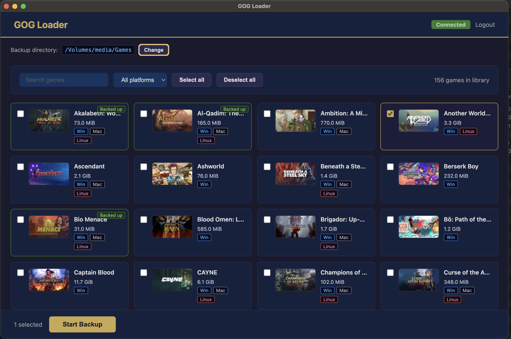

# GOG Loader

GOG Loader is a small Desktop Electron app for browsing your GOG library and downloading local backups of your games. It authenticates against GOG, shows your owned titles in a browser UI, and downloads installers plus bonus content into a local directory.



## What It Does

- Authenticates against GOG inside an Electron window
- Falls back to manual token or authorization-code input if the login flow does not complete automatically
- Loads the user's GOG game library
- Estimates download sizes for each game
- Lets the user filter and select games to back up
- Downloads installers and bonus content into a configurable local directory
- Resumes partial downloads when the server supports byte ranges
- Writes per-game backup metadata so completed files can be skipped on later runs

## Project Layout

```text
.
├── main.js
├── preload.js
├── renderer/
│   ├── index.html
│   └── renderer.js
└── src/
    ├── backup-manager.js
    └── gog-client.js
```

- `main.js`: Electron main process, window creation, settings, and IPC handlers
- `preload.js`: safe renderer API exposed through `contextBridge`
- `renderer/index.html`: UI shell and styles
- `renderer/renderer.js`: front-end app flow, library rendering, and backup progress UI
- `src/gog-client.js`: GOG auth, library, product metadata, and download requests
- `src/backup-manager.js`: backup orchestration, retries, resume logic, and status files

## Requirements

- macOS, Linux, or Windows
- Node.js and npm installed

This repository currently uses Electron `^33.0.0` and starts directly with `electron .`.

## Install

```bash
npm install
```

## Run

```bash
npm start
```

Notes:

- This starts a desktop app, so the terminal remains occupied until the Electron process exits.
- If you interrupt the command from the terminal, npm will report a non-zero exit because the app was terminated manually.

## Build Distributables

Use Electron Builder to create packaged apps and installable artifacts.

```bash
npm run pack
```

Creates an unpacked application bundle in `dist/` for the current platform.

```bash
npm run dist
```

Creates distributable artifacts for the current platform in `dist/`.

Platform-specific commands are also available:

- `npm run dist:mac`
- `npm run dist:win`
- `npm run dist:linux`

Current build targets:

- macOS: `dmg`, `zip`
- Windows: `nsis`, `zip`
- Linux: `AppImage`, `tar.gz`

Notes:

- If no custom app icon is configured, Electron Builder falls back to the default Electron icon.
- On macOS, Electron Builder may use a locally available Apple signing identity automatically.
- Generated artifacts and the effective builder config are written to `dist/`.

## Usage

1. Start the app with `npm start`.
2. Click `Login with GOG`.
3. Complete the GOG login flow in the embedded window.
4. If the popup flow fails or closes, paste one of the following into the manual auth form:
   - the final GOG redirect URL containing `code=...`
   - a raw authorization code
   - an `Authorization: Bearer ...` header value
5. Open your library.
6. Optionally change the backup directory.
7. Select games and start the backup.

## Backup Output

By default, backups are written to a `GOG Games` directory under the user's documents folder unless a different directory is selected in the app.

Each game is stored in its own sanitized folder name. Inside that folder, the app writes:

- downloaded installer files
- downloaded bonus-content files
- `.backup-status.json` with the last backup timestamp and file-size metadata

The app also uses a settings file and token file in Electron's user-data directory:

- `settings.json`: stores the selected backup directory
- `.gog-token.json`: stores the current GOG token payload

## How Downloads Behave

- Existing files are skipped if their size matches the expected or previously recorded size.
- Partial downloads are saved with a `.part` suffix until completion.
- Downloads are retried for common transient HTTP and network failures.
- If a server does not support ranged downloads, the app restarts the affected file from the beginning.

## Current Limitations

- There are no automated tests yet.
- Authentication depends on GOG's current web and API behavior, so upstream changes may require code updates.

## Development Notes

- The UI is a plain HTML/CSS/JS renderer, not a framework-based frontend.
- IPC is exposed through the preload bridge on `window.gogAPI`.
- The app uses Node's built-in `fetch` and stream APIs for network and file transfer work.

## Troubleshooting

### Login window closes without authenticating

Use the manual authentication form and paste the final redirect URL, the authorization code, or a bearer token.

### Some game sizes show as unavailable

The app requests product details in batches. If a product details request fails, the library still loads and the size remains unavailable.

### A backup restarts or skips files unexpectedly

The backup manager compares file sizes against expected or previously recorded sizes. Deleting the game's `.backup-status.json` forces the app to rebuild its per-file status for that game on the next run.